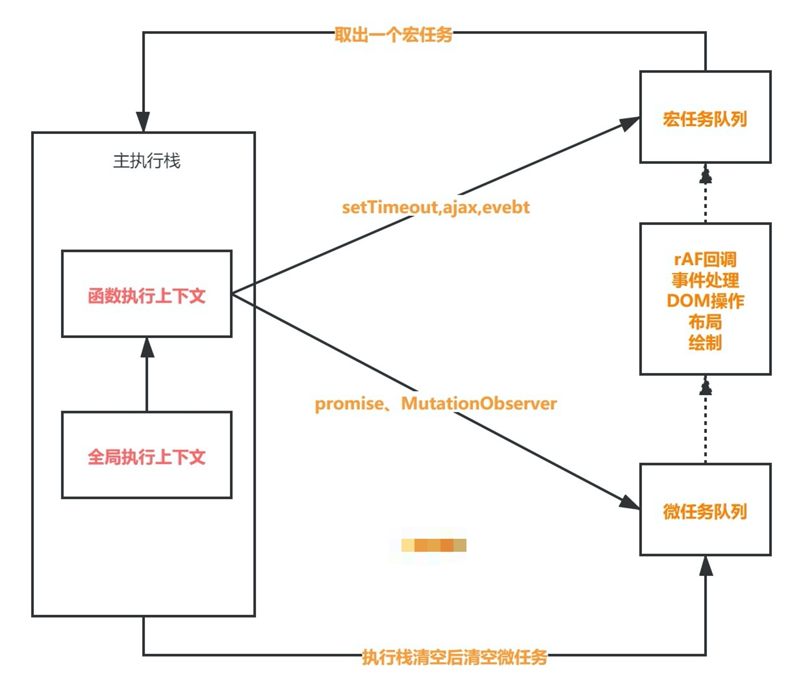
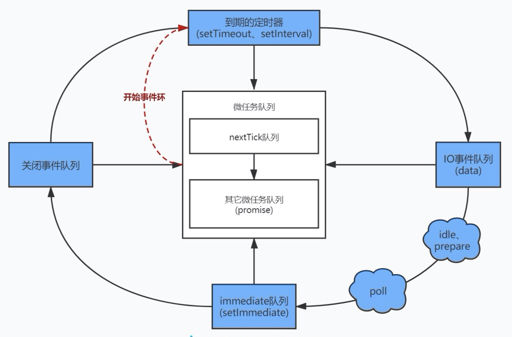

#### EventLoop的使用



**宏任务**

- 页面的大部分任务是在主任务上执行的，比如下面这些都是宏任务
  - 渲染事件(DOM解析、布局、绘制)
  - 用户交互(鼠标点击、页面缩放)
  - JavaScript脚本执行
  - 网络请求
  - 文件读写
- 宏任务会添加到消息队列的尾部，当主线程执行到该消息的时候就会执行
- 每次从事件队列中获取一个事件回调并且放到执行栈中的就是一个宏任务，宏任务执行过程中不会执行其它内容
- 每次宏任务执行完毕后会进行GUI渲染线程的渲染，然后再执行下一个宏任务
- 宏任务: script（整体代码）, setTimeout, setInterval, setImmediate, I/O, UI rendering
- 宏任务颗粒度较大，不适合需要精确控制的任务
- 宏任务是由**宿主方**控制的

```javascript
document.body.style = 'background:red';
setTimeout(function(){
    document.body.style = 'background:yellow'
},0)
```

**微任务**

- 宏任务结束后会进行渲染然后执行下一个宏任务
- 微任务是当前宏任务执行后立即执行的任务
- 当宏任务执行完，就到达了检查点,会先将执行期间所产生的所有微任务都执行完再去进行渲染
- 微任务是由**V8引擎**控制的，在创建全局执行上下文的时候，也会在V8引擎内部创建一个微任务队列
- 微任务: process.nextTick（Nodejs）, Promises, Object.observe, MutationObserver

`promise微任务特点`

- 微任务队列会一次性清空
- 微任务会先于渲染执行
- 宏任务结束之后会先执行微任务

- 比较二者执行栈的区别

[这个地址相信你会有新的认识](https://jakearchibald.com/2015/tasks-microtasks-queues-and-schedules/)

`MutationObserver`

- [MutationObserver](https://developer.mozilla.org/zh-CN/docs/Web/API/MutationObserver)创建并返回一个新的 MutationObserver 它会在指定的DOM发生变化时被调用
- MutationObserver采用了异步 + 微任务的方案
- 异步是为了提升同步操作带来的性能问题
- 微任务是为了解决实时响应的问题

```html
<body>
    <div id="tree"></div>
    <button onclick="start()">开始监听</button>
    <button onclick="changeAttribute()">修改属性</button>
    <button onclick="addChild()">添加子节点，3秒后删除</button>
    <script>
        var targetNode = document.getElementById('tree');
        var config = { attributes: true, childList: true, subtree: true };
        var callback = function (mutationsList) {
            for (var mutation of mutationsList) {
                if (mutation.type == 'childList') {
                    console.log('一个子节点被添加或者删除了');
                }
                else if (mutation.type == 'attributes') {
                    console.log('属性 ' + mutation.attributeName + ' 被改变了.');
                }
            }
        };

        var observer = new MutationObserver(callback);
        function start() {
            observer.observe(targetNode, config);
        }
        function changeAttribute() {
            targetNode.setAttribute('data-name', '树');
        }
        function addChild() {
            let child = document.createElement('div');
            child.innerHTML = '子节点';
            targetNode.appendChild(child);
            setTimeout(() => {
                targetNode.removeChild(child);
            }, 2000);
        }
    </script>
</body>
```

#### EventLoop实现

- JS 分为同步任务和异步任务
- 同步任务都在JS引擎线程上执行，形成一个执行栈
- 事件触发线程管理一个任务队列，异步任务触发条件达成，将回调事件放到任务队列中
- 执行栈中所有同步任务执行完毕，此时JS引擎线程空闲，系统会读取任务队列，将可运行的异步任务回调事件添加到执行栈中，开始执行
- setTimeout/setInterval JS引擎线程=>定时触发器线程=>事件触发线程=>事件队列
- Ajax JS引擎线程=>异步http请求线程=>事件触发线程=>事件队列

**单线执行**

> 无法和外界交互

```javascript
let ret1 = 1 + 1;
let ret2 = 2 + 2;
let ret3 = 3 + 3;
let ret4 = 4 + 4;
console.log(ret1, ret2, ret3, ret4);
```

**事件循环**

```javascript
cnpm i readline-sync -S
```

```javascript
let readline = require('readline-sync');
while (true) {
    var num1 = readline.question('input num1: ');
    var num2 = readline.question('input num2: ');
    let ret = eval(num1 + "+" + num2);
    console.log(ret);
}
```

**setTimeout**

`第一版`

```javascript
// main.js
// 子进程处理定时任务，时间到了send ready事件
const { fork } = require('child_process');
let tasks = [];

function showName() {
    console.log("xx")
}
function setTimeout(callback, timeout) {
    let child = fork('./setTimeout.js');
    child.on('message', function (message) {
        if (message.ready) {
            tasks.push(callback);
        }
    });
    child.send({ type: 'timer', timeout });
}
setTimeout(showName, 1000);
setInterval(() => {
    let task = tasks.shift();
    task && task();
}, 100);
```

```javascript
// setTimeout.js
process.on('message', function (message) {
    let { type, timeout } = message;
    if (type === 'timer') {
        let end = Date.now() + parseFloat(timeout);
        setInterval(() => {
            if (Date.now() >= end) {
                process.send({ ready: true });
                process.exit();
            }
        }, 100);
    }
});
```

`第二版`

```javascript
let tasks = [];

let delayTasks = [];
function showName() {
    console.log("xx");
}
function setTimeout(callback, timeout) {
  	// 延时任务的处理
    delayTasks.push({ callback, start: Date.now(), timeout });
}
setTimeout(showName, 1000);

setInterval(() => {
    let task = tasks.shift();
    task && task();
    delayTasks = delayTasks.filter((item) => {
        if (item.start + item.timeout <= Date.now()) {
            tasks.push(item.callback.bind(item));
            return false;
        }
        return true;
    });
}, 100);
```

`注意事项`

- 当前任务可能会影响定时器任务的执行

```javascript
function task() {
	console.log('zhufeng');
}
function exec() {
  setTimeout(task, 0);
  let start = Date.now();
  let end = start + 500;
  while (Date.now() < end) {
  	console.log(1);
  }
}
exec();
```

- 嵌套的定时器最小间隔为4ms

```javascript
function task() { setTimeout(task, 0); }
setTimeout(task, 0);
```

`XMLHttpRequest`

- IPC(Inter-Process Communication)进程间通信，提供了各种进程间通信的方法

- [xmlhttprequest](https://github.com/chromium/chromium/blob/master/third_party/blink/renderer/core/xmlhttprequest/xml_http_request.cc#L1391)
- XMLHttpRequest是由浏览器的其他进程或发起请求，然后再将执行结果利用 IPC 的方式通知渲染进程，之后渲染进程再将对应的消息添加到消息队列中

```javascript
// main.js
const { fork } = require('child_process');
let tasks = [];
class XMLHttpRequest {
    constructor() {
        this.options = {};
    }
    open(method, url) {
        this.options.method = method;
        this.options.url = url;
    }
    send() {
        let child = fork('./XMLHttpRequest.js');
        child.on('message', (message) => {
            if (message.type === 'response') {
                this.response = message.data;
                tasks.push(this.onload);
            }
        });
        child.send({ type: 'send', options: this.options });
    }
}
function getData() {
    let xhr = new XMLHttpRequest();
    xhr.open('GET', 'http://localhost:3000/data');
    xhr.onload = function () {
        console.log(xhr.response);
    }
    xhr.send();
}
getData();

setInterval(() => {
    let task = tasks.shift();
    task && task();
}, 100);
```

```javascript
// XMLHttpRequest.js
let url = require('url');
let http = require('http');
process.on('message', function (message) {
    let { type, options } = message;
    if (type == 'send') {
        let urlObj = url.parse(options.url);
        const config = {
            hostname: urlObj.hostname,
            port: urlObj.port,
            path: urlObj.path,
            method: options.method
        };
        var req = http.request(config, (res) => {
            let chunks = [];
            res.on('data', (chunk) => {
                chunks.push(chunk);
            });
            res.on('end', () => {
                process.send({
                    type: 'response',
                    data: JSON.parse(Buffer.concat(chunks).toString())
                });
                process.exit();
            });
        });
        req.on('error', (err) => {
            console.error(err);
        });
        req.end();
    }
});
```

`Promise`

```javascript
// main.js 添加微任务队列
const { fork } = require('child_process');
let tasks = [];
let microTasks = []
class XMLHttpRequest {
    constructor() {
        this.options = {};
    }
    open(method, url) {
        this.options.method = method;
        this.options.url = url;
    }
    send() {
        let child = fork('./XMLHttpRequest.js');
        child.on('message', (message) => {
            if (message.type === 'response') {
                this.response = message.data;
                tasks.push(this.onload);
            }
        });
        child.send({ type: 'send', options: this.options });
    }
}


function getData() {
    let xhr = new XMLHttpRequest();
    xhr.open('GET', 'http://localhost:3000/data');
    xhr.onload = function () {
        console.log(xhr.response);
    }
    xhr.send();
}
getData();
class Promise {
    constructor(executor) {
        executor(this.resolve);
    }
    then = (onResolve) => {
        this._onResolve = onResolve;
    }
    resolve = (value) => {
        microTasks.push(() => this._onResolve(value));
    }
}
new Promise(function (resolve) {
    resolve('promise1');
}).then(result => console.log(result));
new Promise(function (resolve) {
    resolve('promise2');
}).then(result => console.log(result));
console.log('同步任务');

setInterval(() => {
    let task = tasks.shift();
    task && task();
    microTasks.forEach(task => task());
    microTasks = [];
}, 100);
```

#### requestAnimationFrame

- [requestAnimationFrame](https://developer.mozilla.org/zh-CN/docs/Web/API/Window/requestAnimationFrame)
- 由浏览器决定何时渲染会更高效
- 浏览器仅渲染到显示器能够达到的频率 1000ms/60=16ms
- 每个帧的开头包括样式计算、布局和绘制
- 如果某个任务执行时间过长，浏览器会推迟渲染
- 当在执行用户交互的任务时，将渲染任务的优先级调整到最高
- 渲染线程完成后将页面解析、定时器等任务优先级提升


**requestAnimationFrame**

- `requestAnimationFrame`回调函数运行在处理CSS之前的绘制之前
- 执行任务阶段不考虑CSS变化，在真正渲染的时候才会看最后的结果
- `getComputedStyle`可以迫使浏览器更早的执行样式计算

```html
<body>
    <div style="background: lightblue;width: 0;height: 20px;"></div>
    <button>走你</button>
    <script>
        /**
         * requestAnimationFrame(callback) 由浏览器专门为动画提供的API
         * cancelAnimationFrame(返回值) 清除动画
         * <16.7 丢帧
         * >16.7 跳跃 卡顿
         */
        const div = document.querySelector('div');
        const button = document.querySelector('button');
        let start;
        function progress() {
            div.style.width = div.offsetWidth + 1 + 'px';
            div.innerHTML = (div.offsetWidth) + '%';
            if (div.offsetWidth < 100)
                timer = requestAnimationFrame(progress);
            else
                console.log(Date.now() - start);
        }
        button.onclick = () => {
            div.style.width = 0;
            start = Date.now();
            requestAnimationFrame(progress);
        }
    </script>
</body>
```

#### requestIdleCallback

- [requestIdleCallback](https://developer.mozilla.org/zh-CN/docs/Web/API/Window/requestIdleCallback)
- window.requestIdleCallback()方法将在浏览器的空闲时段内调用的函数排队
- 这使开发者能够在主事件循环上执行后台和低优先级工作，而不会影响延迟关键事件，如动画和输入响应
- 页面是一帧一帧绘制出来的，当每秒绘制的帧数（FPS）达到 60 时，页面是流畅的，小于这个值时，用户会感觉到卡顿
- 1s 60帧，所以每一帧分到的时间是 1000/60 ≈ 16 ms。所以我们书写代码时力求不让一帧的工作量超过 16ms


****

**requestIdleCallback**

- 上面六个步骤完成后没超过 16 ms，说明时间有富余，此时就会执行 requestIdleCallback 里注册的任务
- [IdleDeadline](https://developer.mozilla.org/zh-CN/docs/Web/API/IdleDeadline)
- callback：回调，即空闲时需要执行的任务，该回调函数接收一个IdleDeadline对象作为入参。其中IdleDeadline对象包含：
  - didTimeout，布尔值，表示任务是否超时，结合 timeRemaining 使用
  - timeRemaining()，表示当前帧剩余的时间，也可理解为留给任务的时间还有多少
- options：目前 options 只有一个参数
  - timeout。表示超过这个时间后，如果任务还没执行，则强制执行，不必等待空闲
- requestIdleCallback发生在一帧的最后，此时页面布局已经完成，所以不建议在 requestIdleCallback 里再操作 DOM，这样会导致页面再次重绘,DOM 操作建议在 rAF 中进行


```javascript
var handle = window.requestIdleCallback(callback[, options])
```

```html
<body>
    <script>
        let task = () => {
            console.log('requestAnimationFrame');
        };

        requestIdleCallback(idleWork, { timeout: 2000 });
        // 任务队列
        const tasks = [
            () => {
                console.log("第一个任务");
                requestAnimationFrame(task);
            },
            () => {
                console.log("第二个任务");
                requestAnimationFrame(task);
            },
            () => {
                console.log("第三个任务");
                requestAnimationFrame(task);
            },
        ];

        function idleWork(deadline) {
            console.log('deadline.timeRemaining()', deadline.timeRemaining());
            while ((deadline.timeRemaining() > 0 || deadline.didTimeout) && tasks.length > 0) {
                work();
            }

            if (tasks.length > 0)
                requestIdleCallback(idleWork);
        }

        function work() {
            tasks.shift()();
            console.log('执行任务');
        }
    </script>
</body>
```

#### Node中的EventLoop

- Node.js采用V8作为js的解析引擎，而I/O处理方面使用了自己设计的libuv
- libuv是一个基于事件驱动的跨平台抽象层，封装了不同操作系统一些底层特性，对外提供统一的API
- 事件循环机制也是它里面的实现
  - V8引擎解析JavaScript脚本并调用Node API
  - libuv库负责Node API的执行。它将不同的任务分配给不同的线程,形成一个Event Loop（事件循环），以异步的方式将任务的执行结果返回给V8引擎
  - V8引擎再将结果返回给用户

**libuv**

- 同步执行全局的脚本
- 执行所有的微任务，先执行nextTick中的所有的任务，再执行其它微任务
- 开始执行宏任务，共有6个阶段，从第1个阶段开始，会执行每一个阶段所有的宏任务




**setImmediate**

- setTimeout/setInterval取值范围是[1,2的32次方-1],超出范围初始化为1，所以 setTimeout(fn,0) = setTimeout(fn,1)

```js
setTimeout(function  () {
  console.log('timeout');
},0);
setImmediate(function  () {
  console.log('immediate');
});

const fs = require('fs')
fs.readFile(__filename, () => {
    setTimeout(() => {
        console.log('timeout');
    }, 0)
    setImmediate(() => {
        console.log('immediate')
    })
})
```

**process.nextTick**

- nextTick独立于Event Loop,有自己的队列，每个阶段完成后如果存在nextTick队列会全部清空，优先级**高于**微任务

```js
setTimeout(() => {
    console.log('setTimeout1')
    Promise.resolve().then(function () {
        console.log('promise1')
    })
}, 0)
setTimeout(() => {
    console.log('setTimeout2')
    Promise.resolve().then(function () {
        console.log('promise2')
    })
}, 0)
setImmediate(() => {
    console.log('setImmediate1')
    Promise.resolve().then(function () {
        console.log('promise3')
    })
}, 0)

process.nextTick(() => {
    console.log('nextTick1');
    Promise.resolve().then(() => console.log('promise4'));
    process.nextTick(() => {
        console.log('nextTick2');
        Promise.resolve().then(() => console.log('promise5'));
        process.nextTick(() => {
            console.log('nextTick3')
            process.nextTick(() => {
                console.log('nextTick4')
            })
        })
    })
})
// nextTick1 nextTick2 nextTick3 nextTick4
//promise4 promise5 setTimeout1  promise1 setTimeout2 promise2  setImmediate1 promise3 
```

